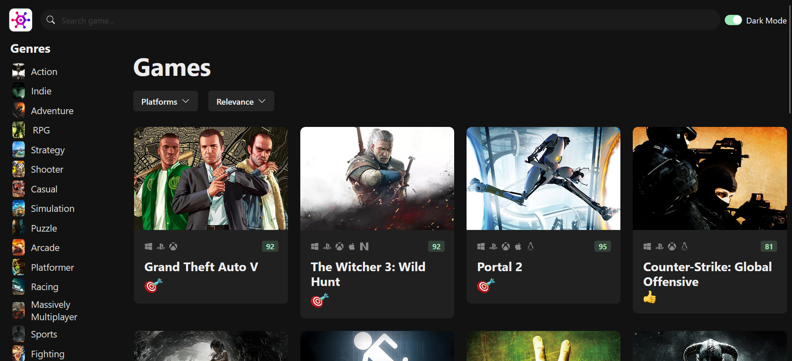

# GameHub

GameHub is a responsive web application built with React, TypeScript, and Chakra UI. It provides users with information about video games, such as genres and game details, using the [RAWG API](https://www.rawg.io). The app is deployed on Vercel and includes a live demo for easy access!

## Table of Contents

- [Screenshots](#screenshots)
- [Features](#features)
- [Tech Stack](#tech-stack)
- [Installation and Setup](#installation-and-setup)
- [API Integration](#api-integration)
- [Custom Hooks](#custom-hooks)
- [License](#license)
- [Contact](#contact)

## Screenshots



You can check out the live demo in the Vercel
[](https://game-hub-beta-gilt.vercel.app/)

## Features

- __Responsive Design__: The app adapts seamlessly across different screen sizes, providing a great user experience on both desktop and mobile devices.

- __Game Information__: Browse and discover various video games, with detailed information such as their genres, platforms, and ratings.

- __Genre Filtering__: Filter games based on genre to easily find games that interest you.

- __Dynamic Data Fetching__: Data is fetched dynamically using custom React hooks for better performance and reusability.

- __Skeleton Loaders__: Uses Chakra UI’s skeleton loaders to enhance user experience with smooth loading placeholders for game cards while data is being fetched.

- __Error Handling__: Proper error management ensures that users are informed when something goes wrong.

- __Modern UI__: Styled using Chakra UI for a clean, modern look.

- __Icons__: Utilizes react-icons to provide visual elements throughout the app.

## Tech Stack

- Frontend:
    - [React](https://react.dev/)
    - [TypeScript](https://www.typescriptlang.org/)
    - [Chakra UI](https://v2.chakra-ui.com/)
    - [React Icons](https://react-icons.github.io/react-icons/)

- API
    - [RAWG API](https://www.rawg.io)

- HTTP Client
    - [Axios](https://www.axios.com/) for making API requests.

- Deployment:
    - [Vercel](https://vercel.com) for deployment.

## Installation and Setup

To run the project locally, follow these steps:

1. Clone the repository:
`
https://github.com/ghezel1995/game-hub.git
`

2. Navigate to the project directory:
` cd game-hub `
3. Install the dependencies:
` npm install `
4. Set up your API key from RAWG API. The api-client.ts file already handles the API key and base URL:

```js
    // src/services/api-client.ts
    import axios from 'axios';

    export default axios.create({
        baseURL: 'https://api.rawg.io/api',
        params: {
            key: 'your-api-key-here', // Replace with your actual API key
        },
    });

```

 5. Start the development server:

` npm start ` and ` http://localhost:3000 `

or if you use vite: 

` npm run dev ` and `http://localhost:5173`

## API Integration

GameHub interacts with the RAWG API to retrieve data about video games, including genres, platforms, and individual game details. Four custom hooks are used to handle dynamic data fetching, making the app scalable and efficient.

## Custom Hooks

1. useData<T>():
  This generic hook is the core data-fetching function. It takes an endpoint, optional request configurations, and dependencies to dynamically fetch data from the API.

  - __Parameters:__

    - `endpoint`: API endpoint for the resource.

    - `requestConfig`: Optional Axios configuration object.

    - `deps`: Dependency array for `useEffect` to trigger refetching.
- Example Usage:

```js
useData<Game>('/games', { params: { genres: genreId } }, [genreId]);
```

2. __useGames():__

This hook is responsible for fetching game data based on the user's query. It takes in a GameQuery object (which includes filters like genre, platform, sort order, and search text) and returns a list of games that match the criteria.

- GameQuery includes:
    - `genre`: Selected genre (e.g., RPG, Action).
    - `platform`: Selected platform (e.g., PC, PlayStation).
    - `sortOrder`: How to sort the games (e.g., by popularity or rating).
    - `searchText`: Text entered by the user for searching games.

- Example Usage:

```js
    useGames({
        genre: selectedGenre,
        platform: selectedPlatform,
        sortOrder: 'popularity',
        searchText: 'Elden Ring',
    });
``` 

3. __useGenres():__

This hook provides a list of game genres. For simplicity and efficiency, it pulls the data from a static local file (data/genres.ts) rather than making a dynamic API request.

- Example Usage:

```js
    const { data: genres, isLoading, error } = useGenres();
```

4. __usePlatforms():__

This hook fetches the list of game platforms (e.g., PlayStation, Xbox, PC) using the RAWG API. It leverages the useData hook to fetch platforms dynamically.

- Example Usage:

```js
    const { data: platforms, isLoading, error } = usePlatforms();
```

These custom hooks make data fetching modular, reusable, and easy to manage across the application, ensuring the app remains performant and maintainable.

## License

This project is licensed under the MIT License - see the LICENSE file for details.

## Contributing

Contributions, issues, and feature requests are welcome!

Feel free to check the [issues page](https://github.com/ghezel1995/game-hub/issues) or submit a pull request.


## Contact

Feel free to reach out with questions or feedback:

- GitHub: [ghezel1995](https://github.com/ghezel1995)
- LinkedIn: [Mahsa Ghezel](https://www.linkedin.com/in/mahsaghezel)
- Personal Website: [My website](https://mahsaghezel1995.netlify.app)

## Future Enhancements

- Add user login and personalized game recommendations.
- Implement a "Favorites" system to allow users to save their favorite games.
- Add more sorting and filtering options for games.


## Enjoy exploring GameHub! 🎮